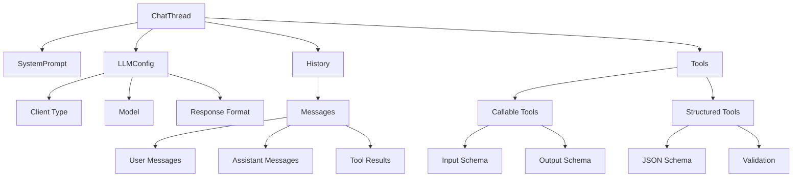

# MultiInference (minference)

A powerful Python library for managing concurrent LLM interactions with support for multiple providers, tool integration, and structured outputs.

## Features

- 🚀 **Multi-Provider Support**: OpenAI, Anthropic, VLLM, LiteLLM, OpenRouter
- 🛠️ **Tool Integration**: Callable and structured tool support with automatic schema derivation
- 🔄 **Workflow Management**: Sequential and parallel execution patterns
- 🔍 **Type Safety**: Comprehensive type checking and validation
- 📊 **Response Formatting**: Multiple response formats including structured JSON
- ⚡ **Concurrent Processing**: Efficient parallel request handling
- 🔄 **Auto-Versioning**: Built-in entity versioning and lineage tracking

## Installation

```bash
pip install minference
```

## Architecture Overview

MultiInference is built around the concept of chat threads, which serve as the primary unit of interaction. Each chat thread maintains its own conversation history, configuration, and tool integrations.

### Chat Thread Architecture



### Key Components

- **SystemPrompt**: Defines the assistant's role and behavior
- **LLMConfig**: Contains provider settings and response preferences
- **History**: Tracks conversation flow including tool interactions
- **Tools**: Integrates both callable functions and structured outputs
  - **Callable Tools**: Executable functions with schema validation
  - **Structured Tools**: JSON schema validation for outputs

The thread-centric design allows for:
- Independent conversation management
- Isolated tool contexts
- Provider-specific configurations
- Flexible response formatting
- Automatic versioning and lineage tracking

## Quick Start

### Basic Usage

```python
import asyncio
from minference.lite.inference import InferenceOrchestrator
from minference.lite.models import (
    ChatThread, LLMConfig, LLMClient, ResponseFormat, SystemPrompt
)

async def main():
    # Initialize orchestrator
    orchestrator = InferenceOrchestrator()
    
    # Create a chat thread
    chat = ChatThread(
        system_prompt=SystemPrompt(
            content="You are a helpful assistant",
            name="basic_assistant"
        ),
        new_message="Hello, how are you?",
        llm_config=LLMConfig(
            client=LLMClient.openai,
            model="gpt-4",
            response_format=ResponseFormat.text
        )
    )
    
    # Run completion
    results = await orchestrator.run_parallel_ai_completion([chat])
    
if __name__ == "__main__":
    asyncio.run(main())
```

### Tool Integration

```python
from pydantic import BaseModel
from typing import List
from minference.lite.models import CallableTool

# Define input/output models
class NumbersInput(BaseModel):
    numbers: List[float]
    round_to: int = 2

class Stats(BaseModel):
    mean: float
    std: float

# Create callable tool
def calculate_stats(input_data: NumbersInput) -> Stats:
    """Calculate statistical measures."""
    return Stats(
        mean=round(statistics.mean(input_data.numbers), input_data.round_to),
        std=round(statistics.stdev(input_data.numbers), input_data.round_to)
    )

# Create tool and chat thread
tool = CallableTool.from_callable(calculate_stats)
chat = ChatThread(
    system_prompt=system_prompt,
    new_message="Analyze these numbers: [1, 2, 3, 4, 5]",
    llm_config=LLMConfig(
        client=LLMClient.openai,
        model="gpt-4",
        response_format=ResponseFormat.tool
    ),
    forced_output=tool
)
```

### Structured Output

```python
from minference.lite.models import StructuredTool

# Define JSON schema
json_schema = {
    "type": "object",
    "properties": {
        "analysis": {"type": "string"},
        "confidence": {"type": "number"}
    },
    "required": ["analysis", "confidence"]
}

# Create structured tool
tool = StructuredTool(
    name="analysis_output",
    description="Generate structured analysis output",
    json_schema=json_schema
)

# Use in chat thread
chat = ChatThread(
    system_prompt=system_prompt,
    new_message="Analyze this text.",
    llm_config=LLMConfig(
        client=LLMClient.openai,
        model="gpt-4",
        response_format=ResponseFormat.structured_output
    ),
    forced_output=tool
)
```

### Parallel Processing

```python
# Create multiple chat threads
chats = [
    ChatThread(...),  # OpenAI
    ChatThread(...),  # Anthropic
    ChatThread(...)   # VLLM
]

# Process all chats in parallel
results = await orchestrator.run_parallel_ai_completion(chats)
```

### Sequential Workflows

```python
tools = [
    CallableTool.from_callable(filter_numbers),
    CallableTool.from_callable(sort_numbers),
    CallableTool.from_callable(calculate_stats)
]

chat = ChatThread(
    system_prompt=system_prompt,
    new_message="Process these numbers sequentially",
    llm_config=LLMConfig(
        client=LLMClient.openai,
        model="gpt-4",
        response_format=ResponseFormat.workflow
    ),
    tools=tools
)
```

## Response Formats

- `text`: Plain text responses
- `json_beg`: JSON with begin/end markers
- `json_object`: Direct JSON object output
- `structured_output`: Schema-validated JSON
- `tool`: Tool-based responses
- `auto_tools`: Automatic tool selection
- `workflow`: Sequential tool execution

## Provider Configuration

```python
from minference.lite.inference import RequestLimits

# Configure provider limits
oai_limits = RequestLimits(
    max_requests_per_minute=500,
    max_tokens_per_minute=200000
)

# Initialize orchestrator with limits
orchestrator = InferenceOrchestrator(
    oai_request_limits=oai_limits,
    anthropic_request_limits=anthropic_limits,
    vllm_request_limits=vllm_limits
)
```

## Advanced Features

### Entity Versioning

The system automatically tracks versions and lineage:

```python
# Entity versions are tracked automatically
chat.fork()  # Create new version
EntityRegistry.get_lineage_tree_sorted(chat.lineage_id)
```

### Custom Tools

Create tools from source code:

```python
tool = CallableTool.from_source(
    source="""
    def analyze(data: dict) -> dict:
        return {"result": process(data)}
    """,
    name="custom_analyzer"
)
```

### Pydantic Integration

Create structured tools from Pydantic models:

```python
class AnalysisOutput(BaseModel):
    result: str
    confidence: float

tool = StructuredTool.from_pydantic(
    model=AnalysisOutput,
    name="analysis_output"
)
```

## API Reference

Detailed API documentation is available at [docs link].

## Contributing

Contributions are welcome! Please read our [Contributing Guide](CONTRIBUTING.md).

## License

This project is licensed under the MIT License - see the [LICENSE](LICENSE) file for details.