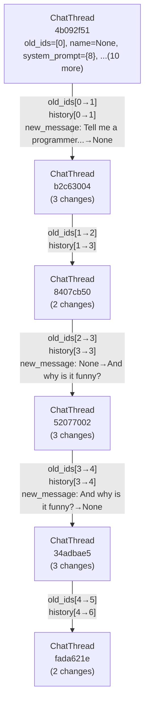

# MultiInference (minference)

**An advanced library for orchestrating LLM interactions across multiple providers, with concurrency, structured outputs, and immutable entity-based versioning.**  
(*No marketing fluff, purely technical.*)

---

## Table of Contents

1. [Overview](#overview)
2. [Core Concepts and Architecture](#core-concepts-and-architecture)
   1. [Entities and Versioning](#entities-and-versioning)
   2. [Registries](#registries)
   3. [Chat Thread Model](#chat-thread-model)
   4. [Tools](#tools)
   5. [Concurrent Execution](#concurrent-execution)
3. [Installation](#installation)
4. [Usage](#usage)
   1. [Minimum Example](#minimum-example)
   2. [ChatThread and LLMConfig](#chatthread-and-llmconfig)
   3. [Running Parallel Inference](#running-parallel-inference)
   4. [Tool Integration](#tool-integration)
   5. [Structured Output](#structured-output)
   6. [Workflow Execution](#workflow-execution)
5. [Advanced Features](#advanced-features)
   1. [Detailed Entity Versioning](#detailed-entity-versioning)
   2. [Lineage Visualization (Mermaid)](#lineage-visualization-mermaid)
   3. [Implementing Custom Tools](#implementing-custom-tools)
   4. [Pydantic-Based Schemas](#pydantic-based-schemas)
   5. [Customizing Provider Limits](#customizing-provider-limits)
6. [Reference: Provided LLM Clients](#reference-provided-llm-clients)
7. [Reference: Response Formats](#reference-response-formats)
8. [Reference: Project Layout](#reference-project-layout)
9. [Contributing](#contributing)
10. [License](#license)

---

## Overview

**MultiInference** is a technical library designed for power users who need:
- Parallel, rate-limited request processing to LLM providers (OpenAI, Anthropic, VLLM, LiteLLM, and OpenRouter).
- A system to store conversation states (*chat threads*) with built-in immutability and versioning.
- Automatic tool integration (both function-based and schema-based).
- Flexible response formats: text, JSON, structured schemas, or multi-step workflows.

The core design revolves around **Entities**. Each conversation, message, or piece of configuration is an **Entity** that undergoes **forking** and versioning whenever modified. This ensures you have a complete lineage of conversation states without accidental in-place mutations.

---

## Core Concepts and Architecture

### Entities and Versioning

All persistent objects (like chat threads, messages, or tools) subclass an `Entity`. Each entity has:
- **`id`** (UUID, identifying one immutable version).
- **`lineage_id`** (UUID, grouping all versions of that entity).
- **`parent_id`** (UUID, pointing to the entity’s immediate predecessor).
- Automatic **`fork`** logic that triggers a new version if you modify an entity.

When you retrieve an entity from the registry, you get a “warm copy” with a new `live_id`. Any changes to that warm copy (detected by comparing to its “cold snapshot”) cause a fork.

**Why?** It ensures an immutable, fully traceable record of changes across your entire system.

### Registries

Two major registries exist:

1. **`EntityRegistry`**: Tracks and stores the immutable “cold snapshots” of each `Entity`. On creation or modification, the new version is stored. You can later retrieve any version by ID, or reconstruct entire lineages.

2. **`CallableRegistry`**: Tracks Python function callables. These are the so-called “tools.” The registry automatically derives JSON schemas for function inputs and outputs (via type hints or Pydantic models). Tools can be:
   - **Synchronous** or **asynchronous** functions.
   - Registered by code text or by passing a function object.

### Chat Thread Model

The central object for multi-turn conversations is `ChatThread`, which inherits from `Entity`.  
A `ChatThread` contains:
- **`history`**: A list of `ChatMessage` entities (also versioned).
- **`system_prompt`**: Optional, to configure instructions.  
- **`llm_config`**: An `LLMConfig` entity specifying which provider to use, model name, token limits, etc.
- **`tools`**: A list of attached tools (either `CallableTool` or `StructuredTool`).
- **`forced_output`**: An optional single tool forced for output usage (`response_format=tool` or `structured_output`).
- **`workflow_step`**: For advanced multi-tool step-by-step workflows.

### Tools

Tools are specialized Entities that can be called by the LLM:

1. **`CallableTool`**:
   - Registered in the `CallableRegistry` with a name and docstring.
   - A typed Python function or code snippet that the LLM can call.
   - The library automatically handles JSON argument passing, schema validation, and more.

2. **`StructuredTool`**:
   - A simpler concept: we only store a JSON schema for validation. The “execution” step is basically verifying user’s JSON output matches the schema.

Tools appear as “functions” or “function calls” to the LLM (OpenAI or Anthropic style) and can be integrated into your conversation flow.

### Concurrent Execution

Parallel requests are managed by a concurrency layer. The code in `oai_parallel.py` reads a batch of JSON lines describing LLM calls, then asynchronously sends them. This system:
- Respects rate limits (requests/minute, tokens/minute).
- Retries on failures or rate-limit errors.
- Writes results to a `.jsonl` file for post-processing.

**High-level**:
1. You compile a list of requests (each describing the conversation state and LLM call).
2. The concurrency processor runs them in parallel (with the specified concurrency/rate constraints).
3. The results are appended to a result file, which you parse back into your domain.

---

## Installation

```bash
git clone https://github.com/marketagents-ai/MultiInference
cd MultiInference
pip install -e .
```

---

## Usage

### Minimum Example

Below is a minimal snippet demonstrating how you can create a single chat thread, run an LLM completion, and get the result:

```python
import asyncio
from minference.threads.inference import InferenceOrchestrator
from minference.threads.models import (
    ChatThread, 
    LLMConfig, 
    LLMClient, 
    ResponseFormat, 
    SystemPrompt
)

async def main():
    orchestrator = InferenceOrchestrator()  # sets up concurrency + provider keys from env

    chat = ChatThread(
        system_prompt=SystemPrompt(
            content="You are a helpful AI. Provide short and direct answers.",
            name="my_prompt"
        ),
        new_message="How's the weather?",
        llm_config=LLMConfig(
            client=LLMClient.openai,
            model="gpt-4o-mini",
            response_format=ResponseFormat.text,
        )
    )

    # This schedules a parallel run, but we just give one thread
    outputs = await orchestrator.run_parallel_ai_completion([chat])

    # outputs is a list of ProcessedOutput
    for out in outputs:
        print("Content:", out.content)

asyncio.run(main())
```

### ChatThread and LLMConfig

A `ChatThread` must have an `LLMConfig` that instructs the system which LLM provider to use, which model, how many tokens, etc. Example:

```python
chat = ChatThread(
    name="my_first_thread",
    system_prompt=SystemPrompt(content="You are an assistant that speaks in JSON only."),
    new_message="Give me a short summary of SpaceX history.",
    llm_config=LLMConfig(
        client=LLMClient.openai,
        model="gpt-3.5-turbo",
        max_tokens=200,
        temperature=0.7,
        response_format=ResponseFormat.json_object
    )
)
```

### Running Parallel Inference

You can batch multiple `ChatThread` objects together, even with different providers:

```python
chat_1 = ChatThread(
    system_prompt=SystemPrompt(content="OpenAI GPT4 prompt"),
    new_message="Hello from GPT4",
    llm_config=LLMConfig(
        client=LLMClient.openai,
        model="gpt-4o-mini",
        response_format=ResponseFormat.text
    )
)

chat_2 = ChatThread(
    system_prompt=SystemPrompt(content="Anthropic Claude prompt"),
    new_message="Hello from Claude",
    llm_config=LLMConfig(
        client=LLMClient.anthropic,
        model="claude-3-5-sonnet-latest",
        response_format=ResponseFormat.text
    )
)

chats = [chat_1, chat_2]
orchestrator = InferenceOrchestrator()

# Runs them in parallel, respecting each provider's rate limits
results = await orchestrator.run_parallel_ai_completion(chats)
for r in results:
    print(f"{r.llm_client} -> {r.content}")
```

### Tool Integration

Tools let you embed function calls within your conversation.  
**Steps**:
1. Implement a Python function with type hints or Pydantic models for arguments/return.
2. Create a `CallableTool` from that function.
3. Attach it to your `ChatThread`.
4. Set `response_format=tool` or `response_format=auto_tools` to let the model attempt calling the tool.

Example:

```python
import statistics
from pydantic import BaseModel
from typing import List
from minference.threads.models import (
    ChatThread, LLMConfig, LLMClient, ResponseFormat, CallableTool
)

class MyInput(BaseModel):
    data: List[float]

class MyOutput(BaseModel):
    mean: float
    stdev: float

def compute_stats(input_data: MyInput) -> MyOutput:
    return MyOutput(
        mean=statistics.mean(input_data.data),
        stdev=statistics.pstdev(input_data.data)
    )

# Register the function as a callable tool
my_tool = CallableTool.from_callable(compute_stats, name="compute_stats")

# Then attach it to your chat
chat = ChatThread(
    new_message="Compute stats for [1,2,3,4,5].",
    llm_config=LLMConfig(
        client=LLMClient.openai,
        model="gpt-4o-mini",
        response_format=ResponseFormat.tool
    ),
    forced_output=my_tool
)

orchestrator = InferenceOrchestrator()
result = await orchestrator.run_parallel_ai_completion([chat])
```

When the LLM sees the `forced_output=my_tool` with `response_format="tool"`, it can call `compute_stats` with JSON arguments. The library automatically handles calling your Python function and returning the result to the chat.

### Structured Output

For generating strictly structured data, you can define a `StructuredTool` that only enforces a JSON schema:

```python
from minference.threads.models import StructuredTool

json_schema = {
    "type": "object",
    "properties": {
        "analysis": {"type": "string"},
        "score": {"type": "number"}
    },
    "required": ["analysis", "score"]
}

structured_tool = StructuredTool(
    name="analysis_schema",
    description="Enforce analysis output with a numeric score",
    json_schema=json_schema,
    strict_schema=True
)

chat = ChatThread(
    new_message="Analyze sentiment of 'Hello World'",
    llm_config=LLMConfig(
        client=LLMClient.openai,
        model="gpt-4o-mini",
        response_format=ResponseFormat.structured_output
    ),
    forced_output=structured_tool
)

await orchestrator.run_parallel_ai_completion([chat])
```

The LLM is asked to produce JSON that matches the schema. The library validates it (if valid, it proceeds, otherwise it logs an error message).

### Workflow Execution

Set `response_format=workflow` for multi-step tool usage. In that mode, the chat tries to use `tools[workflow_step]` in sequence. Each call updates `workflow_step`:

```python
tools = [
    CallableTool.from_callable(func_step1),
    CallableTool.from_callable(func_step2),
    CallableTool.from_callable(func_step3)
]

chat = ChatThread(
    new_message="Perform steps in sequence on data: [1,2,3,4,5]",
    llm_config=LLMConfig(
        client=LLMClient.openai,
        model="gpt-4o-mini",
        response_format=ResponseFormat.workflow
    ),
    tools=tools
)

# The library ensures it calls step0, then step1, then step2, etc.
await orchestrator.run_parallel_ai_completion([chat])
```

---

## Advanced Features

### Detailed Entity Versioning

All objects are `Entity`s. For instance, `ChatThread` extends `Entity`. If you do:

```python
old_id = chat.id
chat.llm_config.temperature = 0.9  # modifies the warm copy
# Next time we register or run something, a new version with a new ID is created
new_id = chat.id
```

Internally, the system calls `fork()` and stores your new version in the `EntityRegistry`. You can retrieve the old version or see the entire lineage:

```python
from minference.ecs.entity import EntityRegistry

lineage = EntityRegistry.get_lineage_tree_sorted(chat.lineage_id)
print(lineage["sorted_ids"])  # all version IDs, sorted by time
```

### Lineage Visualization (Mermaid)

If you call `EntityRegistry.get_lineage_mermaid(lineage_id)`, you get a **Mermaid** graph text showing the version ancestry.


```

### Implementing Custom Tools

A custom tool can be built from Python source:

```python
tool = CallableTool.from_source(
    source="""
def multiply_and_add(x: float, y: float, z: float) -> float:
    return x*y + z
""",
    name="multiply_and_add"
)
```

Or from a Python function directly. The library auto-derives input/output schemas from your function’s type hints or from a Pydantic model signature.

### Pydantic-Based Schemas

You can build a `StructuredTool` directly from a Pydantic model:

```python
from pydantic import BaseModel

class AnalysisOutput(BaseModel):
    text: str
    confidence: float

structured_tool = StructuredTool.from_pydantic(
    model=AnalysisOutput,
    name="analysis_output",
    description="Generates an analysis text with a confidence score"
)
```

### Customizing Provider Limits

Each provider has default rate-limits. For example, if you want to override them:

```python
from minference.threads.inference import InferenceOrchestrator, RequestLimits

oai_limits = RequestLimits(
    max_requests_per_minute=1000,
    max_tokens_per_minute=500000,
    provider="openai"
)

orchestrator = InferenceOrchestrator(oai_request_limits=oai_limits)
```

This ensures concurrency obeys these constraints for that provider.

---

## Reference: Provided LLM Clients

`LLMClient` is an enum with the following choices:

- `openai` — Standard OpenAI Chat API
- `anthropic` — Anthropic Claude endpoints
- `vllm` — Self-hosted vLLM
- `litellm` — Another local approach or custom endpoint
- `openrouter` — A router-like aggregator that’s OpenAI-compatible

---

## Reference: Response Formats

`ResponseFormat` is an enum with modes controlling how the library shapes your final output:

- **`text`**: Plain text response from the LLM.  
- **`json_beg`**: The LLM tries to produce JSON enclosed in code fences (like \`\`\`json ...\`\`\`).  
- **`json_object`**: The LLM is asked to produce a direct JSON object.  
- **`structured_output`**: The LLM is forced to generate JSON matching a `StructuredTool`’s schema.  
- **`tool`**: The LLM is forced to call a single `CallableTool`.  
- **`auto_tools`**: The LLM can pick from multiple available tools automatically.  
- **`workflow`**: The LLM must call tools in a strictly sequential order (like a pipeline).

---

## Reference: Project Layout

A brief mapping of the major files:

- **`ecs/`**  
  - `entity.py`: Defines `Entity`, `EntityRegistry`, `entity_tracer` decorator (handles forking).  
  - `caregistry.py`: Defines `CallableRegistry` for function-based “tools.”  

- **`threads/`**  
  - `models.py`: Contains core domain classes (`ChatThread`, `LLMConfig`, `ChatMessage`, `CallableTool`, `StructuredTool`, etc.)  
  - `inference.py`: Defines the `InferenceOrchestrator` that runs concurrency logic, bridging chat threads to the asynchronous request pipeline.  

- **`oai_parallel.py`**  
  - The concurrency engine for parallel requests, with request queueing, token counting, and retries.

- **`clients/requests.py`**  
  - Utility methods for converting `ChatThread` objects into raw JSON requests, and for re-validating them.  

- **`clients/clients_models.py`**  
  - Pydantic models describing request/response schemas for OpenAI and Anthropic endpoints.  

---

## Contributing

We welcome PRs that expand support or refine concurrency logic. See [CONTRIBUTING.md](CONTRIBUTING.md) for code guidelines, testing approach, etc. Remember to keep PRs aligned with the **immutable entity design**.

---

## License

This project is licensed under the [MIT License](./LICENSE).  