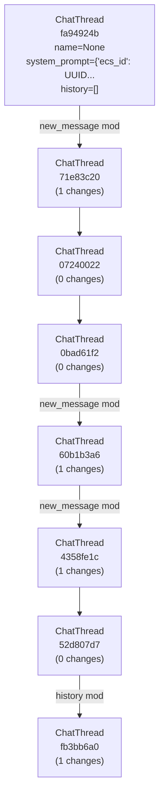

(.venv) tommasos-MBP:MarketInference tommasofurlanello$ /Users/tommasofurlanello/Documents/Dev/MarketInference/.venv/bin/python /Users/tommasofurlanello/Documents/Dev/MarketInference/examples/lite_inference_sql_example.py
Created base_entity table directly with SQL

Table: generated_json_object
  obj_data: JSON
  obj_schema: JSON
  obj_name: VARCHAR(255)
  obj_object: JSON
  tool_call_id: VARCHAR(255)
  id: INTEGER
  ecs_id: CHAR(32)
  lineage_id: CHAR(32)
  parent_id: CHAR(32)
  created_at: DATETIME
  old_ids: JSON
  entity_type: VARCHAR(50)

Table: llm_config
  model: VARCHAR(100)
  provider_name: VARCHAR(50)
  provider_api_key: VARCHAR(255)
  max_tokens: INTEGER
  temperature: FLOAT
  response_format: JSON
  llm_config: JSON
  use_cache: BOOLEAN
  reasoner: BOOLEAN
  reasoning_effort: VARCHAR(20)
  id: INTEGER
  ecs_id: CHAR(32)
  lineage_id: CHAR(32)
  parent_id: CHAR(32)
  created_at: DATETIME
  old_ids: JSON
  entity_type: VARCHAR(50)

Table: raw_output
  raw_result: JSON
  completion_kwargs: JSON
  start_time: INTEGER
  end_time: INTEGER
  chat_thread_id: CHAR(32)
  chat_thread_live_id: CHAR(32)
  client_type: VARCHAR(50)
  id: INTEGER
  ecs_id: CHAR(32)
  lineage_id: CHAR(32)
  parent_id: CHAR(32)
  created_at: DATETIME
  old_ids: JSON
  entity_type: VARCHAR(50)

Table: request_limits
  max_requests_per_minute: INTEGER
  max_tokens_per_minute: INTEGER
  provider: VARCHAR(20)
  id: INTEGER
  ecs_id: CHAR(32)
  lineage_id: CHAR(32)
  parent_id: CHAR(32)
  created_at: DATETIME
  old_ids: JSON
  entity_type: VARCHAR(50)

Table: system_prompt
  content: TEXT
  prompt_name: VARCHAR(255)
  prompt_description: TEXT
  id: INTEGER
  ecs_id: CHAR(32)
  lineage_id: CHAR(32)
  parent_id: CHAR(32)
  created_at: DATETIME
  old_ids: JSON
  entity_type: VARCHAR(50)

Table: tool
  name: VARCHAR(255)
  tool_description: TEXT
  tool_parameters_schema: JSON
  tool_type: VARCHAR(50)
  id: INTEGER
  ecs_id: CHAR(32)
  lineage_id: CHAR(32)
  parent_id: CHAR(32)
  created_at: DATETIME
  old_ids: JSON
  entity_type: VARCHAR(50)

Table: usage
  prompt_tokens: INTEGER
  completion_tokens: INTEGER
  total_tokens: INTEGER
  model: VARCHAR(100)
  cache_creation_input_tokens: INTEGER
  cache_read_input_tokens: INTEGER
  accepted_prediction_tokens: INTEGER
  audio_tokens: INTEGER
  reasoning_tokens: INTEGER
  rejected_prediction_tokens: INTEGER
  cached_tokens: INTEGER
  id: INTEGER
  ecs_id: CHAR(32)
  lineage_id: CHAR(32)
  parent_id: CHAR(32)
  created_at: DATETIME
  old_ids: JSON
  entity_type: VARCHAR(50)

Table: callable_tool
  id: INTEGER
  input_schema: JSON
  output_schema: JSON
  strict_schema: BOOLEAN
  callable_text: TEXT

Table: chat_thread
  system_prompt_id: CHAR(32)
  llm_config_id: CHAR(32)
  title: VARCHAR(255)
  thread_metadata: JSON
  workflow_step: INTEGER
  new_message: TEXT
  prefill: TEXT
  postfill: TEXT
  use_schema_instruction: BOOLEAN
  use_history: BOOLEAN
  forced_output_id: CHAR(32)
  id: INTEGER
  ecs_id: CHAR(32)
  lineage_id: CHAR(32)
  parent_id: CHAR(32)
  created_at: DATETIME
  old_ids: JSON
  entity_type: VARCHAR(50)

Table: processed_output
  raw_output_id: CHAR(32)
  json_object_id: CHAR(32)
  usage_id: CHAR(32)
  content: TEXT
  error: TEXT
  time_taken: INTEGER
  llm_client_type: VARCHAR(50)
  chat_thread_id: CHAR(32)
  chat_thread_live_id: CHAR(32)
  id: INTEGER
  ecs_id: CHAR(32)
  lineage_id: CHAR(32)
  parent_id: CHAR(32)
  created_at: DATETIME
  old_ids: JSON
  entity_type: VARCHAR(50)

Table: structured_tool
  id: INTEGER
  tool_output_schema: JSON
  instruction_string: TEXT
  strict_schema: BOOLEAN

Table: chat_message
  chat_thread_id: CHAR(32)
  parent_message_id: CHAR(32)
  tool_id: CHAR(32)
  usage_id: CHAR(32)
  role: VARCHAR(50)
  content: TEXT
  author_uuid: CHAR(32)
  timestamp: DATETIME
  tool_name: VARCHAR(255)
  tool_uuid: CHAR(32)
  tool_type: VARCHAR(50)
  oai_tool_call_id: VARCHAR(255)
  tool_json_schema: JSON
  tool_call: JSON
  id: INTEGER
  ecs_id: CHAR(32)
  lineage_id: CHAR(32)
  parent_id: CHAR(32)
  created_at: DATETIME
  old_ids: JSON
  entity_type: VARCHAR(50)

Table: chat_thread_tools
  chat_thread_id: CHAR(32)
  tool_id: CHAR(32)
base_entity table exists: True
request_limits table exists: True
All tables in database: ['base_entity', 'sqlite_sequence', 'system_prompt', 'llm_config', 'tool', 'usage', 'generated_json_object', 'raw_output', 'request_limits', 'chat_thread', 'callable_tool', 'structured_tool', 'processed_output', 'chat_thread_tools', 'chat_message']
✅ Good: RequestLimits found in ENTITY_MODEL_MAP (mapped to RequestLimitsSQL)
Entity to ORM mapping:
 - ChatThread -> ChatThreadSQL
 - ChatMessage -> ChatMessageSQL
 - SystemPrompt -> SystemPromptSQL
 - LLMConfig -> LLMConfigSQL
 - CallableTool -> CallableToolSQL
 - StructuredTool -> StructuredToolSQL
 - Usage -> UsageSQL
 - GeneratedJsonObject -> GeneratedJsonObjectSQL
 - RawOutput -> RawOutputSQL
 - ProcessedOutput -> ProcessedOutputSQL
 - RequestLimits -> RequestLimitsSQL
 - Entity -> BaseEntitySQL

[omitted for context]

Modification:Checking modifications: ChatThread(52d807d7-9e9b-4b73-b012-c3de11bb5a22) vs ChatThread(52d807d7-9e9b-4b73-b012-c3de11bb5a22) [SQL: True]
INFO:EntityDepsGraph:Initializing dependency graph for ChatThread(52d807d7-9e9b-4b73-b012-c3de11bb5a22)
INFO:EntityDepsGraph:Initializing dependency graph for ChatMessage(17538cb9-b9f2-410a-b663-997203b3aca6)
INFO:entity_dependencies:Built dependency graph with 1 nodes
INFO:EntityDepsGraph:No cycles detected in entity relationships
INFO:EntityDepsGraph:Initializing dependency graph for ChatMessage(e75f5b47-9722-4ba0-bf34-cd949c648b0f)
INFO:entity_dependencies:Built dependency graph with 1 nodes
INFO:EntityDepsGraph:No cycles detected in entity relationships
INFO:EntityDepsGraph:Initializing dependency graph for ChatMessage(e9e538bc-fbb0-4790-a502-b7adabee0ad9)
INFO:entity_dependencies:Built dependency graph with 1 nodes
INFO:EntityDepsGraph:No cycles detected in entity relationships
INFO:EntityRegistry:Converting ChatThread(52d807d7-9e9b-4b73-b012-c3de11bb5a22) history to OpenAI format
INFO:EntityRegistry:Processing message: role=MessageRole.user, tool_call_id=None
INFO:EntityRegistry:Processing message: role=MessageRole.tool, tool_call_id=call_E7Xgo4SqDG87dHeQJzO7mK9T
INFO:EntityRegistry:Processing message: role=MessageRole.user, tool_call_id=None
INFO:EntityRegistry:Processing message: role=MessageRole.assistant, tool_call_id=call_E7Xgo4SqDG87dHeQJzO7mK9T
INFO:EntityRegistry:Final messages for ChatThread(52d807d7-9e9b-4b73-b012-c3de11bb5a22): [{'role': 'system', 'content': 'You are a helpful assistant that tells programmer jokes.'}, {'role': 'user', 'content': 'Tell me a programmer joke about the number 0.'}, {'role': 'tool', 'content': '{"status": "validated", "message": "Schema validation successful"}', 'tool_call_id': 'call_E7Xgo4SqDG87dHeQJzO7mK9T'}, {'role': 'user', 'content': 'And why is it funny?'}, {'role': 'assistant', 'content': '', 'tool_calls': [{'id': 'call_E7Xgo4SqDG87dHeQJzO7mK9T', 'type': 'function', 'function': {'name': 'tell_joke', 'arguments': '{"joke": "Why did the programmer get stuck in the shower? Because he got a \'0\' in his code!", "explanation": "In programming, a \'0\' often represents a false value or an error. The joke plays on the idea that the programmer\'s code failed (got a \'0\'), causing him to be stuck, just like a loop that never ends."}'}}]}]
INFO:EntityDepsGraph:Initializing dependency graph for ChatMessage(9eb78c31-1d40-4306-9a9b-92ecf6165167)
INFO:entity_dependencies:Built dependency graph with 1 nodes
INFO:EntityDepsGraph:No cycles detected in entity relationships
INFO:entity_dependencies:Built dependency graph with 10 nodes
INFO:EntityDepsGraph:No cycles detected in entity relationships
INFO:EntityComparison:Comparing entities: StructuredTool(9a15ac21-fb1f-4866-b807-13883b6e5f97) vs StructuredTool(9a15ac21-fb1f-4866-b807-13883b6e5f97)
INFO:EntityComparison:Comparison result: has_diffs=False, found 0 different fields
INFO:EntityComparison:Comparing entities: ChatMessage(b86356d5-43e3-4146-aeae-38ebd02cd623) vs ChatMessage(b86356d5-43e3-4146-aeae-38ebd02cd623)
INFO:EntityComparison:Field 'chat_thread_id' has different values: fa94924b-69dd-41e1-8ad8-77ced495f5fb vs 52d807d7-9e9b-4b73-b012-c3de11bb5a22
INFO:EntityComparison:Field 'timestamp' has different values: 2025-03-11 18:47:53.110331+00:00 vs 2025-03-11 18:47:53.110331
INFO:EntityComparison:Comparison result: has_diffs=True, found 2 different fields
INFO:EntityModification:Direct field differences found in ChatMessage(b86356d5-43e3-4146-aeae-38ebd02cd623)
INFO:EntityModification:Field 'chat_thread_id' has significant changes
INFO:EntityModification:Entity ChatMessage(b86356d5-43e3-4146-aeae-38ebd02cd623) has significant changes requiring fork
INFO:EntityModification:Marking parent ChatThread(52d807d7-9e9b-4b73-b012-c3de11bb5a22) for forking due to child changes
INFO:EntityComparison:Comparing entities: ChatMessage(cdf965f6-8cdf-44d5-8c19-48ce779b165f) vs ChatMessage(cdf965f6-8cdf-44d5-8c19-48ce779b165f)
INFO:EntityComparison:Field 'chat_thread_id' has different values: 07240022-fa47-4c6a-bdf0-86b8928f292a vs 52d807d7-9e9b-4b73-b012-c3de11bb5a22
INFO:EntityComparison:Field 'timestamp' has different values: 2025-03-11 18:47:56.346460+00:00 vs 2025-03-11 18:47:56.346460
INFO:EntityComparison:Comparison result: has_diffs=True, found 2 different fields
INFO:EntityModification:Direct field differences found in ChatMessage(cdf965f6-8cdf-44d5-8c19-48ce779b165f)
INFO:EntityModification:Field 'chat_thread_id' has significant changes
INFO:EntityModification:Entity ChatMessage(cdf965f6-8cdf-44d5-8c19-48ce779b165f) has significant changes requiring fork
INFO:EntityComparison:Comparing entities: ChatMessage(d45d4754-d5e8-4df7-9f58-7b80d1d16ce8) vs ChatMessage(d45d4754-d5e8-4df7-9f58-7b80d1d16ce8)
INFO:EntityComparison:Field 'chat_thread_id' has different values: 60b1b3a6-f611-4f64-8735-033b5360f0cb vs 52d807d7-9e9b-4b73-b012-c3de11bb5a22
INFO:EntityComparison:Field 'timestamp' has different values: 2025-03-11 18:47:56.459994+00:00 vs 2025-03-11 18:47:56.459994
INFO:EntityComparison:Comparison result: has_diffs=True, found 2 different fields
INFO:EntityModification:Direct field differences found in ChatMessage(d45d4754-d5e8-4df7-9f58-7b80d1d16ce8)
INFO:EntityModification:Field 'chat_thread_id' has significant changes
INFO:EntityModification:Entity ChatMessage(d45d4754-d5e8-4df7-9f58-7b80d1d16ce8) has significant changes requiring fork
INFO:EntityComparison:Comparing entities: LLMConfig(6aec244f-3818-4cb5-b8cc-ee146fc87d03) vs LLMConfig(6aec244f-3818-4cb5-b8cc-ee146fc87d03)
INFO:EntityComparison:Comparison result: has_diffs=False, found 0 different fields
INFO:EntityComparison:Comparing entities: SystemPrompt(a51ec24b-3bc5-4594-9424-4a68d538c89a) vs SystemPrompt(a51ec24b-3bc5-4594-9424-4a68d538c89a)
INFO:EntityComparison:Comparison result: has_diffs=False, found 0 different fields
INFO:EntityComparison:Comparing entities: Usage(70c07444-e302-4fb8-b4b5-13c037d9307d) vs Usage(70c07444-e302-4fb8-b4b5-13c037d9307d)
INFO:EntityComparison:Comparison result: has_diffs=False, found 0 different fields
INFO:EntityComparison:Comparing entities: ChatMessage(f6f9e75e-31f8-4eee-8faa-a3e9fc4151c4) vs ChatMessage(f6f9e75e-31f8-4eee-8faa-a3e9fc4151c4)
INFO:EntityComparison:Field 'chat_thread_id' has different values: 07240022-fa47-4c6a-bdf0-86b8928f292a vs 52d807d7-9e9b-4b73-b012-c3de11bb5a22
INFO:EntityComparison:Field 'timestamp' has different values: 2025-03-11 18:47:56.338153+00:00 vs 2025-03-11 18:47:56.338153
INFO:EntityComparison:Comparison result: has_diffs=True, found 2 different fields
INFO:EntityModification:Direct field differences found in ChatMessage(f6f9e75e-31f8-4eee-8faa-a3e9fc4151c4)
INFO:EntityModification:Field 'chat_thread_id' has significant changes
INFO:EntityModification:Entity ChatMessage(f6f9e75e-31f8-4eee-8faa-a3e9fc4151c4) has significant changes requiring fork
INFO:EntityComparison:Comparing entities: ChatThread(52d807d7-9e9b-4b73-b012-c3de11bb5a22) vs ChatThread(52d807d7-9e9b-4b73-b012-c3de11bb5a22)
INFO:EntityComparison:Field 'history' has different list lengths: 6 vs 4
INFO:EntityComparison:Comparison result: has_diffs=True, found 1 different fields
INFO:EntityModification:Direct field differences found in ChatThread(52d807d7-9e9b-4b73-b012-c3de11bb5a22)
INFO:EntityModification:Field 'history' has significant changes
INFO:EntityModification:Entity ChatThread(52d807d7-9e9b-4b73-b012-c3de11bb5a22) has significant changes requiring fork
INFO:EntityModification:Modification check result: needs_fork=True, modified_entities=5
INFO:EntityTracer:Entity ChatThread(52d807d7-9e9b-4b73-b012-c3de11bb5a22) needs fork - forking after call
INFO:EntityFork:Forking entity: ChatThread(52d807d7-9e9b-4b73-b012-c3de11bb5a22)
INFO:EntityModification:Checking modifications: ChatThread(52d807d7-9e9b-4b73-b012-c3de11bb5a22) vs ChatThread(52d807d7-9e9b-4b73-b012-c3de11bb5a22) [SQL: True]
INFO:EntityDepsGraph:Initializing dependency graph for ChatThread(52d807d7-9e9b-4b73-b012-c3de11bb5a22)
INFO:EntityDepsGraph:Initializing dependency graph for ChatMessage(fed888c6-9d10-46ee-bf84-888bcfceeb98)
INFO:entity_dependencies:Built dependency graph with 1 nodes
INFO:EntityDepsGraph:No cycles detected in entity relationships
INFO:EntityDepsGraph:Initializing dependency graph for ChatMessage(a44ee325-48d2-49cb-b277-6bbb8b08818f)
INFO:entity_dependencies:Built dependency graph with 1 nodes
INFO:EntityDepsGraph:No cycles detected in entity relationships
INFO:EntityDepsGraph:Initializing dependency graph for ChatMessage(d5ba8c5f-6e2d-4db4-867e-21b488c181d3)
INFO:entity_dependencies:Built dependency graph with 1 nodes
INFO:EntityDepsGraph:No cycles detected in entity relationships
INFO:EntityRegistry:Converting ChatThread(52d807d7-9e9b-4b73-b012-c3de11bb5a22) history to OpenAI format
INFO:EntityRegistry:Processing message: role=MessageRole.user, tool_call_id=None
INFO:EntityRegistry:Processing message: role=MessageRole.tool, tool_call_id=call_E7Xgo4SqDG87dHeQJzO7mK9T
INFO:EntityRegistry:Processing message: role=MessageRole.user, tool_call_id=None
INFO:EntityRegistry:Processing message: role=MessageRole.assistant, tool_call_id=call_E7Xgo4SqDG87dHeQJzO7mK9T
INFO:EntityRegistry:Final messages for ChatThread(52d807d7-9e9b-4b73-b012-c3de11bb5a22): [{'role': 'system', 'content': 'You are a helpful assistant that tells programmer jokes.'}, {'role': 'user', 'content': 'Tell me a programmer joke about the number 0.'}, {'role': 'tool', 'content': '{"status": "validated", "message": "Schema validation successful"}', 'tool_call_id': 'call_E7Xgo4SqDG87dHeQJzO7mK9T'}, {'role': 'user', 'content': 'And why is it funny?'}, {'role': 'assistant', 'content': '', 'tool_calls': [{'id': 'call_E7Xgo4SqDG87dHeQJzO7mK9T', 'type': 'function', 'function': {'name': 'tell_joke', 'arguments': '{"joke": "Why did the programmer get stuck in the shower? Because he got a \'0\' in his code!", "explanation": "In programming, a \'0\' often represents a false value or an error. The joke plays on the idea that the programmer\'s code failed (got a \'0\'), causing him to be stuck, just like a loop that never ends."}'}}]}]
INFO:EntityDepsGraph:Initializing dependency graph for ChatMessage(a153c712-7af6-4427-9c2b-c924fd2419a8)
INFO:entity_dependencies:Built dependency graph with 1 nodes
INFO:EntityDepsGraph:No cycles detected in entity relationships
INFO:entity_dependencies:Built dependency graph with 10 nodes
INFO:EntityDepsGraph:No cycles detected in entity relationships
INFO:EntityComparison:Comparing entities: StructuredTool(9a15ac21-fb1f-4866-b807-13883b6e5f97) vs StructuredTool(9a15ac21-fb1f-4866-b807-13883b6e5f97)
INFO:EntityComparison:Comparison result: has_diffs=False, found 0 different fields
INFO:EntityComparison:Comparing entities: ChatMessage(b86356d5-43e3-4146-aeae-38ebd02cd623) vs ChatMessage(b86356d5-43e3-4146-aeae-38ebd02cd623)
INFO:EntityComparison:Field 'chat_thread_id' has different values: fa94924b-69dd-41e1-8ad8-77ced495f5fb vs 52d807d7-9e9b-4b73-b012-c3de11bb5a22
INFO:EntityComparison:Field 'timestamp' has different values: 2025-03-11 18:47:53.110331+00:00 vs 2025-03-11 18:47:53.110331
INFO:EntityComparison:Comparison result: has_diffs=True, found 2 different fields
INFO:EntityModification:Direct field differences found in ChatMessage(b86356d5-43e3-4146-aeae-38ebd02cd623)
INFO:EntityModification:Field 'chat_thread_id' has significant changes
INFO:EntityModification:Entity ChatMessage(b86356d5-43e3-4146-aeae-38ebd02cd623) has significant changes requiring fork
INFO:EntityModification:Marking parent ChatThread(52d807d7-9e9b-4b73-b012-c3de11bb5a22) for forking due to child changes
INFO:EntityComparison:Comparing entities: ChatMessage(cdf965f6-8cdf-44d5-8c19-48ce779b165f) vs ChatMessage(cdf965f6-8cdf-44d5-8c19-48ce779b165f)
INFO:EntityComparison:Field 'chat_thread_id' has different values: 07240022-fa47-4c6a-bdf0-86b8928f292a vs 52d807d7-9e9b-4b73-b012-c3de11bb5a22
INFO:EntityComparison:Field 'timestamp' has different values: 2025-03-11 18:47:56.346460+00:00 vs 2025-03-11 18:47:56.346460
INFO:EntityComparison:Comparison result: has_diffs=True, found 2 different fields
INFO:EntityModification:Direct field differences found in ChatMessage(cdf965f6-8cdf-44d5-8c19-48ce779b165f)
INFO:EntityModification:Field 'chat_thread_id' has significant changes
INFO:EntityModification:Entity ChatMessage(cdf965f6-8cdf-44d5-8c19-48ce779b165f) has significant changes requiring fork
INFO:EntityComparison:Comparing entities: ChatMessage(d45d4754-d5e8-4df7-9f58-7b80d1d16ce8) vs ChatMessage(d45d4754-d5e8-4df7-9f58-7b80d1d16ce8)
INFO:EntityComparison:Field 'chat_thread_id' has different values: 60b1b3a6-f611-4f64-8735-033b5360f0cb vs 52d807d7-9e9b-4b73-b012-c3de11bb5a22
INFO:EntityComparison:Field 'timestamp' has different values: 2025-03-11 18:47:56.459994+00:00 vs 2025-03-11 18:47:56.459994
INFO:EntityComparison:Comparison result: has_diffs=True, found 2 different fields
INFO:EntityModification:Direct field differences found in ChatMessage(d45d4754-d5e8-4df7-9f58-7b80d1d16ce8)
INFO:EntityModification:Field 'chat_thread_id' has significant changes
INFO:EntityModification:Entity ChatMessage(d45d4754-d5e8-4df7-9f58-7b80d1d16ce8) has significant changes requiring fork
INFO:EntityComparison:Comparing entities: LLMConfig(6aec244f-3818-4cb5-b8cc-ee146fc87d03) vs LLMConfig(6aec244f-3818-4cb5-b8cc-ee146fc87d03)
INFO:EntityComparison:Comparison result: has_diffs=False, found 0 different fields
INFO:EntityComparison:Comparing entities: SystemPrompt(a51ec24b-3bc5-4594-9424-4a68d538c89a) vs SystemPrompt(a51ec24b-3bc5-4594-9424-4a68d538c89a)
INFO:EntityComparison:Comparison result: has_diffs=False, found 0 different fields
INFO:EntityComparison:Comparing entities: Usage(70c07444-e302-4fb8-b4b5-13c037d9307d) vs Usage(70c07444-e302-4fb8-b4b5-13c037d9307d)
INFO:EntityComparison:Comparison result: has_diffs=False, found 0 different fields
INFO:EntityComparison:Comparing entities: ChatMessage(f6f9e75e-31f8-4eee-8faa-a3e9fc4151c4) vs ChatMessage(f6f9e75e-31f8-4eee-8faa-a3e9fc4151c4)
INFO:EntityComparison:Field 'chat_thread_id' has different values: 07240022-fa47-4c6a-bdf0-86b8928f292a vs 52d807d7-9e9b-4b73-b012-c3de11bb5a22
INFO:EntityComparison:Field 'timestamp' has different values: 2025-03-11 18:47:56.338153+00:00 vs 2025-03-11 18:47:56.338153
INFO:EntityComparison:Comparison result: has_diffs=True, found 2 different fields
INFO:EntityModification:Direct field differences found in ChatMessage(f6f9e75e-31f8-4eee-8faa-a3e9fc4151c4)
INFO:EntityModification:Field 'chat_thread_id' has significant changes
INFO:EntityModification:Entity ChatMessage(f6f9e75e-31f8-4eee-8faa-a3e9fc4151c4) has significant changes requiring fork
INFO:EntityComparison:Comparing entities: ChatThread(52d807d7-9e9b-4b73-b012-c3de11bb5a22) vs ChatThread(52d807d7-9e9b-4b73-b012-c3de11bb5a22)
INFO:EntityComparison:Field 'history' has different list lengths: 6 vs 4
INFO:EntityComparison:Comparison result: has_diffs=True, found 1 different fields
INFO:EntityModification:Direct field differences found in ChatThread(52d807d7-9e9b-4b73-b012-c3de11bb5a22)
INFO:EntityModification:Field 'history' has significant changes
INFO:EntityModification:Entity ChatThread(52d807d7-9e9b-4b73-b012-c3de11bb5a22) has significant changes requiring fork
INFO:EntityModification:Modification check result: needs_fork=True, modified_entities=5
INFO:EntityFork:Found 5 entities to fork
INFO:EntityFork:Sorted 5 entities for forking in dependency order
INFO:SqlEntityStorage:Processing 10 entities in topological order
Skipping chat_thread_id update - already set to fa94924b-69dd-41e1-8ad8-77ced495f5fb
Updated chat_thread_id=07240022-fa47-4c6a-bdf0-86b8928f292a for message cdf965f6-8cdf-44d5-8c19-48ce779b165f
Updated chat_thread_id=60b1b3a6-f611-4f64-8735-033b5360f0cb for message d45d4754-d5e8-4df7-9f58-7b80d1d16ce8
Updated chat_thread_id=07240022-fa47-4c6a-bdf0-86b8928f292a for message f6f9e75e-31f8-4eee-8faa-a3e9fc4151c4
Added 4 messages to ChatThreadSQL 52d807d7-9e9b-4b73-b012-c3de11bb5a22
Message IDs: 0f0f1ee5-f75c-4439-b702-3fb7d153bff1, f6f9e75e-31f8-4eee-8faa-a3e9fc4151c4, cdf965f6-8cdf-44d5-8c19-48ce779b165f, d45d4754-d5e8-4df7-9f58-7b80d1d16ce8
INFO:SqlEntityStorage:Processing 10 entities in topological order
Updated chat_thread_id=fa94924b-69dd-41e1-8ad8-77ced495f5fb for message 0f0f1ee5-f75c-4439-b702-3fb7d153bff1
Updated chat_thread_id=07240022-fa47-4c6a-bdf0-86b8928f292a for message cdf965f6-8cdf-44d5-8c19-48ce779b165f
Updated chat_thread_id=60b1b3a6-f611-4f64-8735-033b5360f0cb for message d45d4754-d5e8-4df7-9f58-7b80d1d16ce8
Skipping chat_thread_id update - already set to 07240022-fa47-4c6a-bdf0-86b8928f292a
Added 4 messages to ChatThreadSQL 52d807d7-9e9b-4b73-b012-c3de11bb5a22
Message IDs: 0f0f1ee5-f75c-4439-b702-3fb7d153bff1, 73bef378-815e-4205-b637-d54745e7c837, cdf965f6-8cdf-44d5-8c19-48ce779b165f, d45d4754-d5e8-4df7-9f58-7b80d1d16ce8
INFO:SqlEntityStorage:Processing 10 entities in topological order
Updated chat_thread_id=fa94924b-69dd-41e1-8ad8-77ced495f5fb for message 0f0f1ee5-f75c-4439-b702-3fb7d153bff1
Updated chat_thread_id=07240022-fa47-4c6a-bdf0-86b8928f292a for message cdf965f6-8cdf-44d5-8c19-48ce779b165f
Skipping chat_thread_id update - already set to 60b1b3a6-f611-4f64-8735-033b5360f0cb
Updated chat_thread_id=07240022-fa47-4c6a-bdf0-86b8928f292a for message 73bef378-815e-4205-b637-d54745e7c837
Added 4 messages to ChatThreadSQL 52d807d7-9e9b-4b73-b012-c3de11bb5a22
Message IDs: 0f0f1ee5-f75c-4439-b702-3fb7d153bff1, 73bef378-815e-4205-b637-d54745e7c837, cdf965f6-8cdf-44d5-8c19-48ce779b165f, cb744c55-f258-4b2c-95c0-7ddc9a4fec9b
INFO:SqlEntityStorage:Processing 10 entities in topological order
Updated chat_thread_id=fa94924b-69dd-41e1-8ad8-77ced495f5fb for message 0f0f1ee5-f75c-4439-b702-3fb7d153bff1
Skipping chat_thread_id update - already set to 07240022-fa47-4c6a-bdf0-86b8928f292a
Updated chat_thread_id=60b1b3a6-f611-4f64-8735-033b5360f0cb for message cb744c55-f258-4b2c-95c0-7ddc9a4fec9b
Updated chat_thread_id=07240022-fa47-4c6a-bdf0-86b8928f292a for message 73bef378-815e-4205-b637-d54745e7c837
Added 4 messages to ChatThreadSQL 52d807d7-9e9b-4b73-b012-c3de11bb5a22
Message IDs: 0f0f1ee5-f75c-4439-b702-3fb7d153bff1, 73bef378-815e-4205-b637-d54745e7c837, 0c0c1539-1d90-438f-8006-93b6dd3519b5, cb744c55-f258-4b2c-95c0-7ddc9a4fec9b
INFO:SqlEntityStorage:Processing 10 entities in topological order
Updated chat_thread_id=fa94924b-69dd-41e1-8ad8-77ced495f5fb for message 0f0f1ee5-f75c-4439-b702-3fb7d153bff1
Updated chat_thread_id=07240022-fa47-4c6a-bdf0-86b8928f292a for message 0c0c1539-1d90-438f-8006-93b6dd3519b5
Updated chat_thread_id=60b1b3a6-f611-4f64-8735-033b5360f0cb for message cb744c55-f258-4b2c-95c0-7ddc9a4fec9b
Updated chat_thread_id=07240022-fa47-4c6a-bdf0-86b8928f292a for message 73bef378-815e-4205-b637-d54745e7c837
Added 4 messages to ChatThreadSQL fb3bb6a0-d896-4d3e-925b-fce93ce5a622
Message IDs: 0f0f1ee5-f75c-4439-b702-3fb7d153bff1, 73bef378-815e-4205-b637-d54745e7c837, 0c0c1539-1d90-438f-8006-93b6dd3519b5, cb744c55-f258-4b2c-95c0-7ddc9a4fec9b
INFO:EntityDepsGraph:Initializing dependency graph for ChatThread(fb3bb6a0-d896-4d3e-925b-fce93ce5a622)
INFO:EntityDepsGraph:Initializing dependency graph for ChatMessage(a38dd03c-dc6a-415a-9e7f-1f1fa4444c87)
INFO:entity_dependencies:Built dependency graph with 1 nodes
INFO:EntityDepsGraph:No cycles detected in entity relationships
INFO:EntityDepsGraph:Initializing dependency graph for ChatMessage(2a61e44b-f6e7-4e80-8287-4198d8150d2a)
INFO:entity_dependencies:Built dependency graph with 1 nodes
INFO:EntityDepsGraph:No cycles detected in entity relationships
INFO:EntityDepsGraph:Initializing dependency graph for ChatMessage(a5898296-152d-4ed2-8177-28179c58d404)
INFO:entity_dependencies:Built dependency graph with 1 nodes
INFO:EntityDepsGraph:No cycles detected in entity relationships
INFO:EntityRegistry:Converting ChatThread(fb3bb6a0-d896-4d3e-925b-fce93ce5a622) history to OpenAI format
INFO:EntityRegistry:Processing message: role=MessageRole.user, tool_call_id=None
INFO:EntityRegistry:Processing message: role=MessageRole.assistant, tool_call_id=call_E7Xgo4SqDG87dHeQJzO7mK9T
INFO:EntityRegistry:Processing message: role=MessageRole.tool, tool_call_id=call_E7Xgo4SqDG87dHeQJzO7mK9T
INFO:EntityRegistry:Processing message: role=MessageRole.user, tool_call_id=None
INFO:EntityRegistry:Processing message: role=MessageRole.assistant, tool_call_id=call_T3ec1cWGPsHUna35OWhx741i
INFO:EntityRegistry:Processing message: role=MessageRole.tool, tool_call_id=call_T3ec1cWGPsHUna35OWhx741i
INFO:EntityRegistry:Final messages for ChatThread(fb3bb6a0-d896-4d3e-925b-fce93ce5a622): [{'role': 'system', 'content': 'You are a helpful assistant that tells programmer jokes.'}, {'role': 'user', 'content': 'Tell me a programmer joke about the number 0.'}, {'role': 'assistant', 'content': '', 'tool_calls': [{'id': 'call_E7Xgo4SqDG87dHeQJzO7mK9T', 'type': 'function', 'function': {'name': 'tell_joke', 'arguments': '{"joke": "Why did the programmer get stuck in the shower? Because he got a \'0\' in his code!", "explanation": "In programming, a \'0\' often represents a false value or an error. The joke plays on the idea that the programmer\'s code failed (got a \'0\'), causing him to be stuck, just like a loop that never ends."}'}}]}, {'role': 'tool', 'content': '{"status": "validated", "message": "Schema validation successful"}', 'tool_call_id': 'call_E7Xgo4SqDG87dHeQJzO7mK9T'}, {'role': 'user', 'content': 'And why is it funny?'}, {'role': 'assistant', 'content': '', 'tool_calls': [{'id': 'call_T3ec1cWGPsHUna35OWhx741i', 'type': 'function', 'function': {'name': 'tell_joke', 'arguments': '{"joke": "Why do programmers prefer dark mode? Because light attracts bugs!", "explanation": "This joke is funny because it plays on the double meaning of \'bugs.\' In programming, \'bugs\' refer to errors or issues in the code, while in the real world, light attracts insects (bugs). The humor comes from the clever wordplay."}'}}]}, {'role': 'tool', 'content': '{"status": "validated", "message": "Schema validation successful"}', 'tool_call_id': 'call_T3ec1cWGPsHUna35OWhx741i'}]
INFO:EntityDepsGraph:Initializing dependency graph for ChatMessage(e3b83885-dbbb-4b8e-a357-2bce95ef5de3)
INFO:entity_dependencies:Built dependency graph with 1 nodes
INFO:EntityDepsGraph:No cycles detected in entity relationships
INFO:entity_dependencies:Built dependency graph with 13 nodes
INFO:EntityDepsGraph:No cycles detected in entity relationships
INFO:EntityFork:Fork complete: ChatThread(fb3bb6a0-d896-4d3e-925b-fce93ce5a622)
INFO:EntityModification:Checking modifications: ProcessedOutput(4dd258d2-725c-48ff-b591-ae31763f6b55) vs ProcessedOutput(4dd258d2-725c-48ff-b591-ae31763f6b55) [SQL: True]
INFO:EntityDepsGraph:Initializing dependency graph for ProcessedOutput(4dd258d2-725c-48ff-b591-ae31763f6b55)
INFO:EntityDepsGraph:Initializing dependency graph for GeneratedJsonObject(8d2ab500-a8a3-48c6-bef9-8601a83bcf4e)
INFO:entity_dependencies:Built dependency graph with 1 nodes
INFO:EntityDepsGraph:No cycles detected in entity relationships
INFO:SqlEntityStorage:Processing 1 entities in topological order
INFO:EntityDepsGraph:Initializing dependency graph for Usage(2ee71737-d096-44d0-a70e-c2c8e0965065)
INFO:entity_dependencies:Built dependency graph with 1 nodes
INFO:EntityDepsGraph:No cycles detected in entity relationships
INFO:SqlEntityStorage:Processing 1 entities in topological order
INFO:EntityRegistry:Parsed OpenAI completion: tell_joke, ecs_id=UUID('2ee71737-d096-44d0-a70e-c2c8e0965065') live_id=UUID('78f77e38-8f5c-418e-bb8d-aa9279b5597b') created_at=datetime.datetime(2025, 3, 11, 18, 47, 58, 351650, tzinfo=datetime.timezone.utc) parent_id=None lineage_id=UUID('e6fc8250-a077-4e48-b2b6-b1b3f32a8056') old_ids=[] from_storage=False force_parent_fork=False sql_root=True deps_graph=EntityDependencyGraph(nodes={UUID('2ee71737-d096-44d0-a70e-c2c8e0965065'): Node(2ee71737-d096-44d0-a70e-c2c8e0965065, deps=0, dependents=0)}, cycles=[]) is_being_registered=False model='gpt-4o-mini-2024-07-18' prompt_tokens=201 completion_tokens=73 total_tokens=274 cache_creation_input_tokens=None cache_read_input_tokens=None accepted_prediction_tokens=0 audio_tokens=0 reasoning_tokens=0 rejected_prediction_tokens=0 cached_tokens=0
INFO:entity_dependencies:Built dependency graph with 6 nodes
INFO:EntityDepsGraph:No cycles detected in entity relationships
INFO:EntityComparison:Comparing entities: GeneratedJsonObject(96f7acdb-5512-4221-8a54-2d318439fb2a) vs GeneratedJsonObject(96f7acdb-5512-4221-8a54-2d318439fb2a)
INFO:EntityComparison:Comparison result: has_diffs=False, found 0 different fields
INFO:EntityComparison:Comparing entities: Usage(bea1619b-a5af-4331-9b57-41ad8371e08f) vs Usage(bea1619b-a5af-4331-9b57-41ad8371e08f)
INFO:EntityComparison:Comparison result: has_diffs=False, found 0 different fields
INFO:EntityComparison:Comparing entities: RawOutput(e466a67c-11d4-4492-a8c1-a37f482c6af9) vs RawOutput(e466a67c-11d4-4492-a8c1-a37f482c6af9)
INFO:EntityComparison:Field 'parsed_result' has different values: (None, GeneratedJsonObject(96f7acdb-5512-4221-8a54-2d318439fb2a), Usage(bea1619b-a5af-4331-9b57-41ad8371e08f), None) vs (None, GeneratedJsonObject(8d2ab500-a8a3-48c6-bef9-8601a83bcf4e), Usage(2ee71737-d096-44d0-a70e-c2c8e0965065), None)
INFO:EntityComparison:Comparison result: has_diffs=True, found 1 different fields
INFO:EntityModification:Direct field differences found in RawOutput(e466a67c-11d4-4492-a8c1-a37f482c6af9)
INFO:EntityModification:Field 'parsed_result' has significant changes
INFO:EntityModification:Entity RawOutput(e466a67c-11d4-4492-a8c1-a37f482c6af9) has significant changes requiring fork
INFO:EntityModification:Marking parent ProcessedOutput(4dd258d2-725c-48ff-b591-ae31763f6b55) for forking due to child changes
INFO:EntityComparison:Comparing entities: ProcessedOutput(4dd258d2-725c-48ff-b591-ae31763f6b55) vs ProcessedOutput(4dd258d2-725c-48ff-b591-ae31763f6b55)
INFO:EntityComparison:Comparison result: has_diffs=False, found 0 different fields
INFO:EntityModification:Modification check result: needs_fork=True, modified_entities=2
INFO:EntityTracer:Entity ProcessedOutput(4dd258d2-725c-48ff-b591-ae31763f6b55) needs fork - forking after call
INFO:EntityFork:Forking entity: ProcessedOutput(4dd258d2-725c-48ff-b591-ae31763f6b55)
INFO:EntityModification:Checking modifications: ProcessedOutput(4dd258d2-725c-48ff-b591-ae31763f6b55) vs ProcessedOutput(4dd258d2-725c-48ff-b591-ae31763f6b55) [SQL: True]
INFO:EntityDepsGraph:Initializing dependency graph for ProcessedOutput(4dd258d2-725c-48ff-b591-ae31763f6b55)
INFO:EntityDepsGraph:Initializing dependency graph for GeneratedJsonObject(091e1d2f-93cf-4bf9-b194-b2a416718f70)
INFO:entity_dependencies:Built dependency graph with 1 nodes
INFO:EntityDepsGraph:No cycles detected in entity relationships
INFO:SqlEntityStorage:Processing 1 entities in topological order
INFO:EntityDepsGraph:Initializing dependency graph for Usage(46ead5e7-4a31-411b-a227-5e97d8fc799f)
INFO:entity_dependencies:Built dependency graph with 1 nodes
INFO:EntityDepsGraph:No cycles detected in entity relationships
INFO:SqlEntityStorage:Processing 1 entities in topological order
INFO:EntityRegistry:Parsed OpenAI completion: tell_joke, ecs_id=UUID('46ead5e7-4a31-411b-a227-5e97d8fc799f') live_id=UUID('bc88141e-3440-4112-a1d5-98f683aa838e') created_at=datetime.datetime(2025, 3, 11, 18, 47, 58, 361813, tzinfo=datetime.timezone.utc) parent_id=None lineage_id=UUID('d5c86929-af0e-4d26-a81f-9b1ebee01870') old_ids=[] from_storage=False force_parent_fork=False sql_root=True deps_graph=EntityDependencyGraph(nodes={UUID('46ead5e7-4a31-411b-a227-5e97d8fc799f'): Node(46ead5e7-4a31-411b-a227-5e97d8fc799f, deps=0, dependents=0)}, cycles=[]) is_being_registered=False model='gpt-4o-mini-2024-07-18' prompt_tokens=201 completion_tokens=73 total_tokens=274 cache_creation_input_tokens=None cache_read_input_tokens=None accepted_prediction_tokens=0 audio_tokens=0 reasoning_tokens=0 rejected_prediction_tokens=0 cached_tokens=0
INFO:entity_dependencies:Built dependency graph with 6 nodes
INFO:EntityDepsGraph:No cycles detected in entity relationships
INFO:EntityComparison:Comparing entities: GeneratedJsonObject(96f7acdb-5512-4221-8a54-2d318439fb2a) vs GeneratedJsonObject(96f7acdb-5512-4221-8a54-2d318439fb2a)
INFO:EntityComparison:Comparison result: has_diffs=False, found 0 different fields
INFO:EntityComparison:Comparing entities: Usage(bea1619b-a5af-4331-9b57-41ad8371e08f) vs Usage(bea1619b-a5af-4331-9b57-41ad8371e08f)
INFO:EntityComparison:Comparison result: has_diffs=False, found 0 different fields
INFO:EntityComparison:Comparing entities: RawOutput(e466a67c-11d4-4492-a8c1-a37f482c6af9) vs RawOutput(e466a67c-11d4-4492-a8c1-a37f482c6af9)
INFO:EntityComparison:Field 'parsed_result' has different values: (None, GeneratedJsonObject(96f7acdb-5512-4221-8a54-2d318439fb2a), Usage(bea1619b-a5af-4331-9b57-41ad8371e08f), None) vs (None, GeneratedJsonObject(091e1d2f-93cf-4bf9-b194-b2a416718f70), Usage(46ead5e7-4a31-411b-a227-5e97d8fc799f), None)
INFO:EntityComparison:Comparison result: has_diffs=True, found 1 different fields
INFO:EntityModification:Direct field differences found in RawOutput(e466a67c-11d4-4492-a8c1-a37f482c6af9)
INFO:EntityModification:Field 'parsed_result' has significant changes
INFO:EntityModification:Entity RawOutput(e466a67c-11d4-4492-a8c1-a37f482c6af9) has significant changes requiring fork
INFO:EntityModification:Marking parent ProcessedOutput(4dd258d2-725c-48ff-b591-ae31763f6b55) for forking due to child changes
INFO:EntityComparison:Comparing entities: ProcessedOutput(4dd258d2-725c-48ff-b591-ae31763f6b55) vs ProcessedOutput(4dd258d2-725c-48ff-b591-ae31763f6b55)
INFO:EntityComparison:Comparison result: has_diffs=False, found 0 different fields
INFO:EntityModification:Modification check result: needs_fork=True, modified_entities=2
INFO:EntityFork:Found 2 entities to fork
INFO:EntityFork:Sorted 2 entities for forking in dependency order
INFO:SqlEntityStorage:Processing 4 entities in topological order
INFO:SqlEntityStorage:Processing 4 entities in topological order
INFO:EntityDepsGraph:Initializing dependency graph for ProcessedOutput(eb12bd4c-0e5c-4af1-8e52-d84febe987e9)
INFO:entity_dependencies:Built dependency graph with 4 nodes
INFO:EntityDepsGraph:No cycles detected in entity relationships
INFO:EntityFork:Fork complete: ProcessedOutput(eb12bd4c-0e5c-4af1-8e52-d84febe987e9)
INFO:EntityTracer:Forked 2 entities after calling add_chat_turn_history
Completed in 5.29 seconds
INFO:EntityComparison:Comparing entities: ChatThread(71e83c20-1177-4d97-a9db-3575a737d54e) vs ChatThread(fa94924b-69dd-41e1-8ad8-77ced495f5fb)
INFO:EntityComparison:Field 'new_message' has different values: None vs Tell me a programmer joke about the number 0.
INFO:EntityComparison:Comparison result: has_diffs=True, found 1 different fields
INFO:EntityComparison:Comparing entities: ChatThread(07240022-fa47-4c6a-bdf0-86b8928f292a) vs ChatThread(71e83c20-1177-4d97-a9db-3575a737d54e)
INFO:EntityComparison:Comparison result: has_diffs=False, found 0 different fields
INFO:EntityComparison:Comparing entities: ChatThread(0bad61f2-d436-4440-90ae-12142fd9a810) vs ChatThread(07240022-fa47-4c6a-bdf0-86b8928f292a)
INFO:EntityComparison:Comparison result: has_diffs=False, found 0 different fields
INFO:EntityComparison:Comparing entities: ChatThread(60b1b3a6-f611-4f64-8735-033b5360f0cb) vs ChatThread(0bad61f2-d436-4440-90ae-12142fd9a810)
INFO:EntityComparison:Field 'new_message' has different values: And why is it funny? vs None
INFO:EntityComparison:Comparison result: has_diffs=True, found 1 different fields
INFO:EntityComparison:Comparing entities: ChatThread(4358fe1c-5c67-4152-b9ab-312c1e58dfbb) vs ChatThread(60b1b3a6-f611-4f64-8735-033b5360f0cb)
INFO:EntityComparison:Field 'new_message' has different values: None vs And why is it funny?
INFO:EntityComparison:Comparison result: has_diffs=True, found 1 different fields
INFO:EntityComparison:Comparing entities: ChatThread(52d807d7-9e9b-4b73-b012-c3de11bb5a22) vs ChatThread(4358fe1c-5c67-4152-b9ab-312c1e58dfbb)
INFO:EntityComparison:Comparison result: has_diffs=False, found 0 different fields
INFO:EntityComparison:Comparing entities: ChatThread(fb3bb6a0-d896-4d3e-925b-fce93ce5a622) vs ChatThread(52d807d7-9e9b-4b73-b012-c3de11bb5a22)
INFO:EntityComparison:Field 'history' has different list lengths: 4 vs 0
INFO:EntityComparison:Comparison result: has_diffs=True, found 1 different fields
